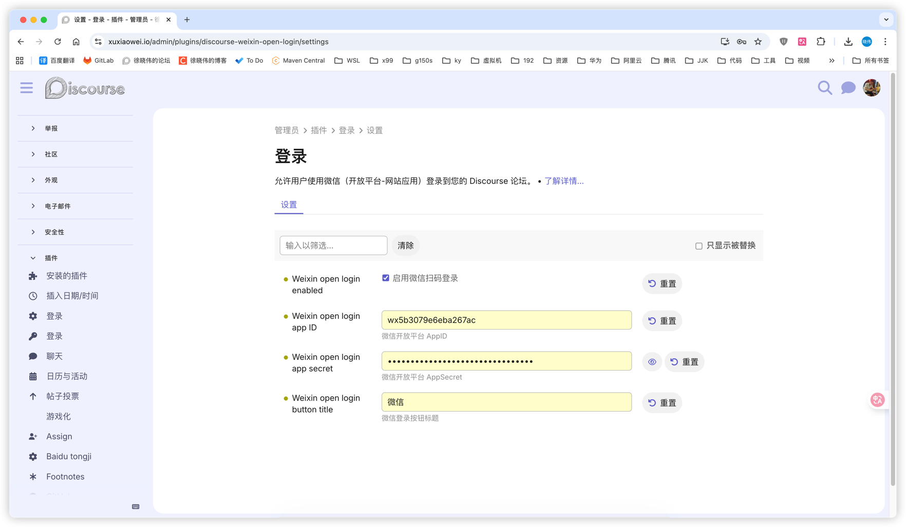

# Discourse 微信开放平台登录插件

这个插件允许用户使用微信开放平台（网站应用）登录到您的 Discourse 论坛。

## 安装

- 将代码克隆到插件目录 `/var/www/discourse/plugins`
    ```shell
    docker exec -it discourse-web-1 bash
    cd /var/www/discourse/plugins
    git clone https://github.com/xuxiaowei-com-cn/discourse-weixin-open-login.git
    ```
- 重启容器
   ```shell
   docker restart discourse-web-1
   ```

## 配置

1. 前往微信开放平台创建一个新的网站应用：
    - 访问 [微信开放平台](https://open.weixin.qq.com/)
    - 登录并进入"管理中心"
    - 点击"网站应用" → "创建应用"
    - 填写必填字段：
        - 应用名称：您的论坛名称
        - 应用描述：您的论坛描述
        - 网站域名：您的论坛域名
        - 授权回调域：`your-forum-url` （将 `your-forum-url` 替换为您的论坛域名，无需 `http://` 或 `https://`）
    - 完成其他必填信息并提交审核
    - 等待审核通过

2. 从微信开放平台应用页面复制 `AppID` 和 `AppSecret`。

3. 在您的 Discourse 管理面板中：
    - 前往 `设置` → `插件` → `微信开放平台登录`
    - 启用 `weixin_open_login_enabled` 设置
    - 输入您从微信开放平台复制的 `AppID` 和 `AppSecret`
    - 根据需要自定义 `weixin_open_login_button_title`
    - 点击 "保存更改"




## 使用

配置完成后，用户将在登录页面看到微信登录按钮。他们可以点击此按钮使用其微信账号进行身份验证并登录到您的论坛。

## 文档

https://developers.weixin.qq.com/doc/oplatform/Website_App/WeChat_Login/Wechat_Login.html
https://developers.weixin.qq.com/doc/oplatform/Website_App/WeChat_Login/Authorized_Interface_Calling_UnionID.html

## 联系我


